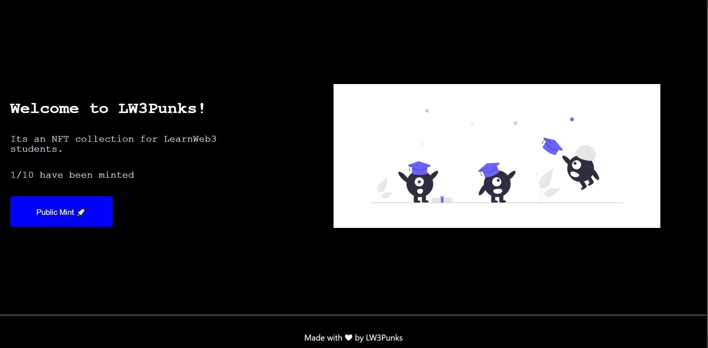

# IPFS-NFT-Collection

    A place where you can mint Crypto Dev NFTs with Polygon's Mumbai Testnet

###  Concepts Involved
  
    - IPFS
    
    - Polygon
    
    - NextJs
            Api Routing
            CSS Modules
            Use Hooks
            State management
            Conditional Rendering
            Async functions
            Timed Functions
      
    - Ethers.js
            Provider
            Signer
            Utils
            call transactions
      
    - Web3Modal
            Metamask Connection
            Web3Modal Provider

    - Solidity    
            OpenZeppelin
            ERC721 Emuerable 
            Ownable
            Custom Smart contracts 
            Receiving Ether
            Mapping
            Payable Function
            Pure Function
            View Functions

    

It illustrates how you can build a part of your marketplace

##### Total Supply
    Total token supply is 10 CryptoDev Tokens
    

### Usage

Here's how the flow Take place

    - A user comes to the site
    - Login Via Metamask
    - Mint

#### Deployment Network

    Polygon Mumbai testnet

#### Deployment Link    
    
https://ipfs-nft-collection-umaresso.vercel.app/
